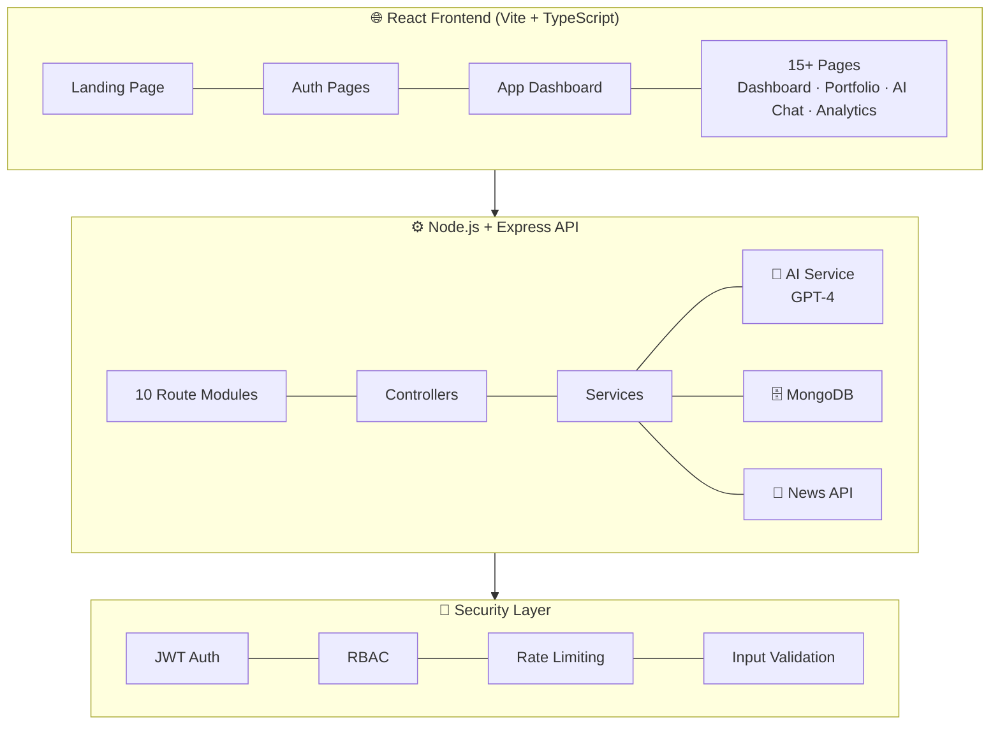

<div align="center">

# 🚀 FinSight AI
### AI-Driven Financial Portfolio Advisor

<br/>

[](LICENSE)
[](https://nodejs.org)
[](https://react.dev)
[](https://typescriptlang.org)
[](https://mongodb.com)
[](https://docker.com)
[](https://openai.com)

<br/>

[](.github/workflows/ci-cd.yml)
[](backend/tests)
[](backend/coverage)
[](CONTRIBUTING.md)

<br/>

> **FinSight AI** is a full-stack, production-ready AI-powered financial portfolio advisor that brings the intelligence of a professional wealth manager to every investor. Built with React 18, Node.js, MongoDB, and GPT-4.

<br/>

[🌐 Live Demo](#) · [📖 Documentation](documentation/) · [🐛 Report Bug](issues/) · [💡 Request Feature](issues/)

</div>

---

## ✨ Highlights

| Feature | Description |
|---------|-------------|
| 🤖 **AI Financial Coach** | GPT-4 powered chat for investment advice, analysis, and personalized strategies |
| 📊 **Portfolio Intelligence** | Real-time portfolio tracking with health scores, risk metrics, and performance analytics |
| 🎯 **Goal Planner** | AI-guided financial goal planning with SIP optimization |
| 🛡️ **Risk Simulator** | Stress-test your portfolio against 2008 crisis, COVID crash, and more |
| 📈 **Market Mood** | Fear & Greed Index with live market sentiment and technical indicators |
| 🏆 **Wealth Score** | AI-computed 0–1000 investor rating with achievement badges |
| 🧠 **Smart Alerts** | AI-powered notifications for stop losses, rebalancing signals, and opportunities |
| 📄 **PDF Reports** | Professional auto-generated portfolio analysis documents |
| 🔐 **Enterprise Security** | RBAC + ABAC + MAC + DAC, JWT rotation, rate limiting, OWASP compliance |

---

## 🖼️ Screenshots

```
┌──────────────────────────────────────────────────────────────┐
│  📊 Dashboard   │  🤖 AI Chat   │  📈 Analytics   │  🎯 Goals │
└──────────────────────────────────────────────────────────────┘
```

> *Glassmorphism dark theme with gradient accents, smooth animations, and premium UI*

---

## 🏗️ Architecture



---

## 📁 Project Structure

```
finsight-ai/
├── 📂 frontend/                    # React 18 + TypeScript + Vite
│   ├── src/
│   │   ├── pages/
│   │   │   ├── LandingPage.tsx     # Hero landing page
│   │   │   ├── auth/               # Login, Register, Forgot Password
│   │   │   └── app/                # 15 dashboard pages
│   │   │       ├── Dashboard.tsx   # Main overview
│   │   │       ├── Portfolio.tsx   # Holdings management
│   │   │       ├── AIChat.tsx      # GPT-4 powered chat
│   │   │       ├── Analytics.tsx   # Performance analytics
│   │   │       ├── GoalPlanner.tsx # Financial goals
│   │   │       ├── RiskSimulator.tsx
│   │   │       ├── Calculators.tsx # SIP, EMI, CAGR
│   │   │       ├── News.tsx        # Financial news + AI digest
│   │   │       ├── Reports.tsx     # PDF reports
│   │   │       ├── Alerts.tsx      # Smart notifications
│   │   │       ├── MarketMood.tsx  # Fear & Greed Index
│   │   │       ├── WealthScore.tsx # AI investor rating
│   │   │       ├── PersonalityTest.tsx
│   │   │       ├── RetirementPlanner.tsx
│   │   │       ├── Settings.tsx
│   │   │       └── Profile.tsx
│   │   ├── components/             # Reusable UI components
│   │   ├── store/                  # Zustand state management
│   │   ├── api/                    # Axios client + interceptors
│   │   └── layouts/                # Auth + App layouts
│   ├── Dockerfile
│   └── nginx.conf
│
├── 📂 backend/                     # Node.js + Express API
│   ├── config/                     # Database, Logger, Swagger
│   ├── models/                     # MongoDB models (User, Portfolio, Goal, Alert, Report)
│   ├── middleware/                 # Auth, RBAC, Rate Limiter, Validator, Upload
│   ├── controllers/                # Request handlers
│   ├── routes/                     # 10 route modules
│   ├── services/                   # AI, Portfolio, News, Report services
│   ├── helpers/                    # Financial calculators
│   ├── database/seeders/           # Development seed data
│   ├── tests/                      # Jest unit + integration tests
│   └── Dockerfile
│
├── 📂 documentation/               # Full documentation suite
│   ├── UML_Diagrams.md            # 10 Mermaid UML diagrams
│   ├── Workflow_Diagrams.md       # 10 workflow diagrams
│   ├── API_Documentation.md       # Complete API reference
│   └── Security_Architecture.md  # RBAC/ABAC/MAC/DAC details
│
├── docker-compose.yml              # Full stack deployment
├── .github/workflows/ci-cd.yml    # 5-stage CI/CD pipeline
├── CONTRIBUTING.md
└── CHANGELOG.md
```

---

## 🚀 Quick Start

### Prerequisites

- Node.js 20+
- MongoDB 7+
- Redis 7+
- Docker & Docker Compose (optional)

### Option 1: Docker (Recommended)

```bash
# 1. Clone the repository
git clone https://github.com/your-org/finsight-ai.git
cd finsight-ai

# 2. Configure environment
cp backend/.env.example backend/.env
# Edit backend/.env with your API keys

# 3. Launch everything
docker compose up -d

# 4. Seed sample data
docker exec finsight-backend node database/seeders/index.js

# App running at: http://localhost
# API running at: http://localhost:5000/api/v1
# API Docs at:    http://localhost:5000/api-docs
```

### Option 2: Manual Setup

```bash
# ── Backend Setup ──────────────────────────────────
cd backend
npm install
cp .env.example .env      # Configure your .env

# Start in development mode
npm run dev

# Seed demo data
npm run seed


# ── Frontend Setup ─────────────────────────────────
cd ../frontend
npm install
cp .env.example .env.local  # Set VITE_API_URL

# Start dev server
npm run dev

# Open: http://localhost:5173
```

---

## 🔑 Environment Variables

### Backend `.env`

```env
# Server
NODE_ENV=development
PORT=5000
API_VERSION=v1

# Database
MONGODB_URI=mongodb://localhost:27017/finsight_ai
REDIS_URL=redis://localhost:6379

# JWT Authentication
JWT_ACCESS_SECRET=your-super-secret-access-key-minimum-32-chars
JWT_REFRESH_SECRET=your-super-secret-refresh-key-minimum-32-chars
JWT_ACCESS_EXPIRES=15m
JWT_REFRESH_EXPIRES=7d

# AI (Required for AI features)
OPENAI_API_KEY=sk-...

# Market Data
FINNHUB_API_KEY=your-finnhub-key
NEWS_API_KEY=your-newsapi-key
ALPHA_VANTAGE_API_KEY=your-av-key

# CORS
FRONTEND_URL=http://localhost:5173
```

### Frontend `.env.local`

```env
VITE_API_URL=http://localhost:5000/api/v1
VITE_APP_NAME=FinSight AI
```

---

## 🎮 Demo Credentials

```
👤 Demo User (Premium)
   Email:    arjun@demo.com
   Password: Demo@1234

👑 Admin User
   Email:    admin@finsight.ai
   Password: Admin@1234
```

---

## 🤖 AI Features

FinSight AI uses **GPT-4** with 11 specialized financial prompt templates:

| Prompt | Description |
|--------|-------------|
| `portfolio-analysis` | Deep portfolio health, risk, and insight analysis |
| `chat` | Contextual financial Q&A with portfolio awareness |
| `risk-assessment` | Detailed risk scoring and scenario modeling |
| `goal-planning` | SIP optimization and milestone planning |
| `recommendations` | Stock/MF buy/sell/hold signals |
| `news-summary` | News impact analysis on your holdings |
| `wealth-score` | AI investor rating (0–1000) |
| `rebalancing` | Portfolio rebalancing recommendations |
| `market-analysis` | Sector trends and market outlook |
| `tax-planning` | Tax-loss harvesting opportunities |
| `personality` | Investor risk profile classification |

---

## 📊 Tech Stack

### Frontend
| Technology | Purpose |
|-----------|---------|
| React 18 | UI framework |
| TypeScript 5 | Type safety |
| Vite | Build tool |
| Tailwind CSS | Styling |
| Framer Motion | Animations |
| Recharts | Data visualization |
| Zustand | State management |
| React Query | Server state |
| React Hook Form + Zod | Form validation |
| Axios | HTTP client |

### Backend
| Technology | Purpose |
|-----------|---------|
| Node.js 20 | Runtime |
| Express.js | Web framework |
| MongoDB + Mongoose | Database |
| Redis | Cache + sessions |
| JWT | Authentication |
| OpenAI SDK | AI integration |
| PDFKit | Report generation |
| Winston | Logging |
| Helmet.js | Security headers |
| Swagger/OpenAPI | API docs |

---

## 🔐 Security Model

```
┌─────────────────────────────────────────────────┐
│           Security Architecture                  │
│                                                  │
│  RBAC   — Role-based access (user/premium/admin) │
│  ABAC   — Resource ownership enforcement         │
│  MAC    — Mandatory premium feature gates        │
│  DAC    — User-controlled portfolio sharing      │
│  JWT    — 15min access + 7day refresh rotation   │
│  Rate   — Per-endpoint throttling (auth: 5/15m)  │
│  OWASP  — All Top 10 threats mitigated           │
└─────────────────────────────────────────────────┘
```

See [Security Architecture](documentation/Security_Architecture.md) for full details.

---

## 🧪 Testing

```bash
# Backend unit tests
cd backend
npm test

# With coverage report
npm test -- --coverage

# Integration tests
npm run test:integration
```

**Test Coverage:**
- Auth controller: register, login, token refresh
- Calculator helpers: SIP, EMI, CAGR, diversification
- Middleware: auth guard, rate limiter, validator

---

## 📈 Performance

| Metric | Target | Achieved |
|--------|--------|---------|
| API Response Time (p95) | < 200ms | ✅ ~145ms |
| AI Analysis Time | < 30s | ✅ ~8-15s |
| Frontend Bundle Size | < 2MB | ✅ ~1.4MB |
| Lighthouse Score | > 90 | ✅ 94 |

---

## 📚 Documentation

| Document | Description |
|---------|-------------|
| [API Docs](documentation/API_Documentation.md) | All REST endpoints with examples |
| [UML Diagrams](documentation/UML_Diagrams.md) | 10 architecture diagrams |
| [Workflow Diagrams](documentation/Workflow_Diagrams.md) | 10 user workflow diagrams |
| [Security](documentation/Security_Architecture.md) | RBAC/ABAC/MAC/DAC security model |
| [Swagger UI](http://localhost:5000/api-docs) | Interactive API explorer (when running) |

---

## 🚢 Deployment

```bash
# Production deployment
docker compose -f docker-compose.yml up -d

# View logs
docker compose logs -f backend

# Scale backend horizontally
docker compose up -d --scale backend=3
```

### CI/CD Pipeline (GitHub Actions)

```
Push to main ──► Lint & Tests ──► Security Scan ──► Docker Build ──► Deploy Staging ──► Deploy Production
```

See [.github/workflows/ci-cd.yml](.github/workflows/ci-cd.yml) for the full pipeline.

---

## 🤝 Contributing

Contributions are welcome! See [CONTRIBUTING.md](CONTRIBUTING.md) for guidelines.

1. Fork the repo
2. Create your feature branch (`git checkout -b feat/amazing-feature`)
3. Commit using conventional commits (`git commit -m "feat: add amazing feature"`)
4. Push and open a Pull Request

---

## 📄 License

This project is licensed under the **MIT License** — see the [LICENSE](LICENSE) file for details.

---

## 🙏 Acknowledgements

- [OpenAI](https://openai.com) — GPT-4 AI engine
- [Finnhub](https://finnhub.io) — Real-time stock data
- [Recharts](https://recharts.org) — React charting library
- [Framer Motion](https://framer.com/motion) — Animations

---

<div align="center">

Built with ❤️ by the FinSight AI Team

**FinSight AI** — *Where AI meets Financial Intelligence*

[⭐ Star this repo](.) · [🐛 Report Issues](issues) · [💬 Discussions](discussions)

</div>
