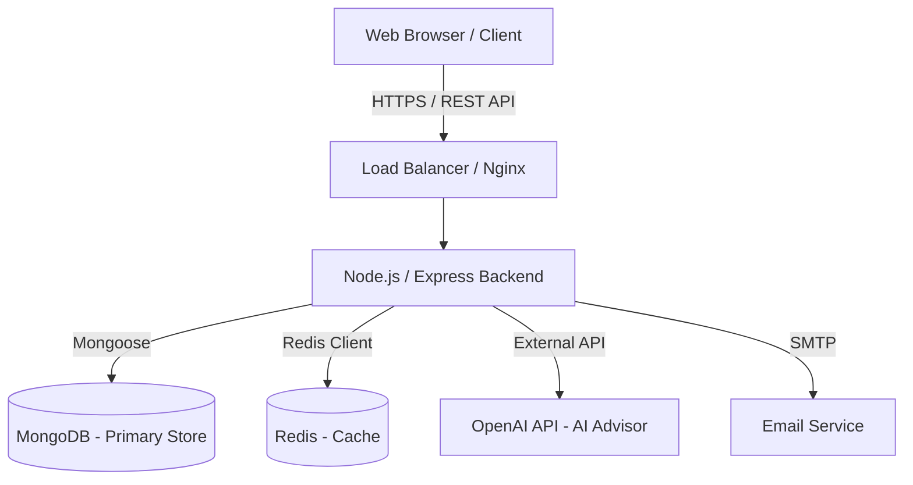

# System Architecture Document

## 1. Overview
FinSight AI utilizes a modern, decoupled **Client-Server Architecture**. The application is broken down into a responsive single-page application (SPA) frontend and a RESTful API backend, supported by a document-oriented database and an in-memory cache.

## 2. High-Level Architecture Diagram

## 3. Frontend Architecture
The frontend is built for performance, type safety, and rich user experience.
*   **Framework**: React 18 with TypeScript.
*   **State Management**: Zustand for global state (`portfolioStore`, `uiStore`), keeping the bundle size small and avoiding prop drilling.
*   **Styling**: Tailwind CSS for utility-first styling, paired with Framer Motion for micro-animations and page transitions.
*   **API Layer**: Abstracted Axios services (`api/client.ts`) for clean component logic.

## 4. Backend Architecture
The backend follows the **Controller-Service-Route** pattern to ensure separation of concerns.
*   **Framework**: Node.js with Express.js.
*   **Controllers**: Handle HTTP request/response parsing and validation.
*   **Services**: House the core business logic (e.g., `email.service.js`, `cache.service.js`).
*   **Data Access Layer**: Mongoose Object Data Modeling (ODM).
*   **Middleware**: Custom middlewares for JWT Auth, ABAC Ownership checks, Rate Limiting, and Redis Response Caching.

## 5. Security Architecture
*   **Transport**: TLS/SSL for all communications.
*   **Authentication**: Stateless JSON Web Tokens (JWT) stored in HTTP-only cookies (or secure headers).
*   **Data Sanitization**: `xss-clean` and `express-mongo-sanitize` to prevent injection attacks.
*   **Access Control**: strict Role-Based (Admin vs User) and Attribute-Based (Resource Ownership) barriers.
