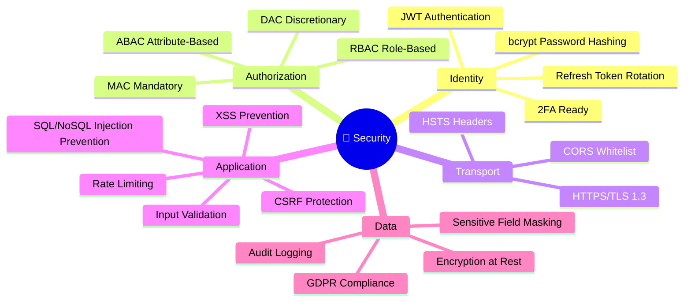

# Security Architecture — FinSight AI

---

## Security Model Overview



---

## 1. Authentication System (JWT)

### Token Architecture

| Token | Expiry | Storage | Purpose |
|-------|--------|---------|---------|
| Access Token | 15 minutes | Memory / Axios interceptor | API authorization |
| Refresh Token | 7 days | HttpOnly Cookie | Silent token renewal |

### Token Flow

```
User Login → JWT.sign(payload, ACCESS_SECRET, 15m)
           → JWT.sign(payload, REFRESH_SECRET, 7d)
           → Store refresh hash in MongoDB
           → Return access in body, refresh in HttpOnly cookie
```

### Token Payload
```json
{
  "userId": "64abc...",
  "email": "user@example.com",
  "role": "premium",
  "iat": 1720425600,
  "exp": 1720426500
}
```

---

## 2. Role-Based Access Control (RBAC)

Three roles with hierarchical inheritance:

| Permission | `user` | `premium` | `admin` |
|-----------|--------|-----------|---------|
| Portfolio CRUD | ✅ | ✅ | ✅ |
| Basic calculators | ✅ | ✅ | ✅ |
| Goal planner | ✅ | ✅ | ✅ |
| News feed | ✅ | ✅ | ✅ |
| AI Chat | Limited (10/day) | ✅ Unlimited | ✅ |
| AI Portfolio Analysis | ❌ | ✅ | ✅ |
| PDF Reports | ❌ | ✅ | ✅ |
| Risk Simulator | ❌ | ✅ | ✅ |
| Benchmark Comparison | ❌ | ✅ | ✅ |
| User management | ❌ | ❌ | ✅ |
| System configuration | ❌ | ❌ | ✅ |

### RBAC Middleware Implementation
```javascript
// Usage in routes:
router.get('/analyze', protect, restrictTo('premium', 'admin'), analyzePortfolio);

// Middleware:
const restrictTo = (...roles) => (req, res, next) => {
  if (!roles.includes(req.user.role)) {
    throw new AppError('You do not have permission', 403);
  }
  next();
};
```

---

## 3. Attribute-Based Access Control (ABAC)

Resource ownership is enforced at the data layer:

```javascript
// User can only access their own portfolios
const portfolio = await Portfolio.findOne({
  _id: req.params.id,
  userId: req.user._id  // ← ABAC: owner check
});

if (!portfolio) throw new AppError('Portfolio not found or access denied', 404);
```

**Attributes evaluated:**
- `resource.userId === requester.userId` (ownership)
- `resource.isPublic === true` (public resources)
- `requester.isPremium === true` (premium features)
- `requester.emailVerified === true` (verified access only)

---

## 4. Mandatory Access Control (MAC)

System-enforced policies that cannot be overridden by users:

```javascript
// Premium guard — enforced regardless of role
const premiumGuard = (req, res, next) => {
  if (!req.user.isPremium && req.user.role !== 'admin') {
    throw new AppError(
      'This feature requires a Premium subscription. Upgrade to unlock.',
      402,
      'PREMIUM_REQUIRED'
    );
  }
  next();
};
```

**MAC Policies:**
- Unverified emails cannot access financial features
- Admin cannot bypass rate limits (DoS protection)
- All financial data write operations require re-authentication after 30 min idle

---

## 5. Discretionary Access Control (DAC)

Users can grant limited access to their own resources (future roadmap):

```
Portfolio Sharing:
  Owner grants → Viewer role → Read-only portfolio access
  Owner grants → Collaborator → Can add assets
  Owner revokes → Immediate access removal
```

---

## 6. Rate Limiting Strategy

```javascript
// General API: 100 req / 15 min
app.use('/api', generalLimiter);

// Auth endpoints: 5 req / 15 min (brute-force protection)
app.use('/api/v1/auth', authLimiter);

// AI endpoints: 20 req / hour (cost control)
app.use('/api/v1/ai', aiLimiter);

// File upload: 10 uploads / hour
app.use('/api/v1/upload', uploadLimiter);
```

---

## 7. Input Validation & Sanitization

All user inputs are validated using **express-validator** before processing:

```javascript
// Example — Portfolio Asset Validation
body('symbol').trim().toUpperCase().isLength({ min: 1, max: 20 }),
body('quantity').isFloat({ min: 0.001, max: 1000000 }),
body('avgBuyPrice').isFloat({ min: 0.01 }),
body('type').isIn(['stock', 'etf', 'mutual_fund', 'bond', 'crypto', 'ppf', 'fd']),
```

**Protection against:**
- NoSQL injection (via Mongoose strict schema)
- XSS (via helmet + input sanitization)
- SQL injection (not applicable — MongoDB)
- Path traversal (file uploads use UUIDs, not user filenames)

---

## 8. Security Headers (Helmet.js)

```
Content-Security-Policy: default-src 'self'; img-src *
X-XSS-Protection: 1; mode=block
X-Frame-Options: DENY
X-Content-Type-Options: nosniff
Strict-Transport-Security: max-age=31536000; includeSubDomains
Referrer-Policy: strict-origin-when-cross-origin
```

---

## 9. Password Security

```javascript
// Hashing: bcrypt with cost factor 12
const hash = await bcrypt.hash(plaintext, 12);

// Never returned in API responses:
UserSchema.set('toJSON', {
  transform: (_, ret) => { delete ret.password; return ret; }
});

// Password strength requirements:
// - Min 8 characters
// - At least 1 uppercase letter
// - At least 1 number
// - Stored as bcrypt hash only
```

---

## 10. Audit Logging

All security-sensitive events are logged via Winston:

```
auth:login:success   → userId, ip, timestamp
auth:login:failure   → email, ip, reason
auth:register        → userId, ip
portfolio:access     → userId, resourceId, action
ai:analyze           → userId, tokensUsed
admin:userUpdate     → adminId, targetUserId, fields
```

---

## 11. GDPR Compliance

- **Data minimization**: Only collect data needed for the service
- **Right to deletion**: `DELETE /users/account` permanently removes all user data
- **Data portability**: Export portfolio as CSV
- **Encryption at rest**: MongoDB Atlas encryption enabled
- **Consent**: Terms acceptance tracked with timestamp

---

## 12. OWASP Top 10 Mitigation

| Threat | Mitigation |
|--------|-----------|
| A01 Broken Access Control | RBAC + ABAC ownership checks |
| A02 Cryptographic Failures | bcrypt(12), JWT HS256, HTTPS |
| A03 Injection | Mongoose schemas, express-validator |
| A04 Insecure Design | Security-first architecture review |
| A05 Security Misconfiguration | Helmet.js, CORS whitelist, .env secrets |
| A06 Vulnerable Components | npm audit in CI/CD pipeline |
| A07 Authentication Failures | Rate limiting, JWT rotation, 2FA ready |
| A08 Software Integrity | npm lockfile, Docker image scanning |
| A09 Security Logging | Winston audit logs, all auth events |
| A10 SSRF | No user-controlled URLs in backend |
