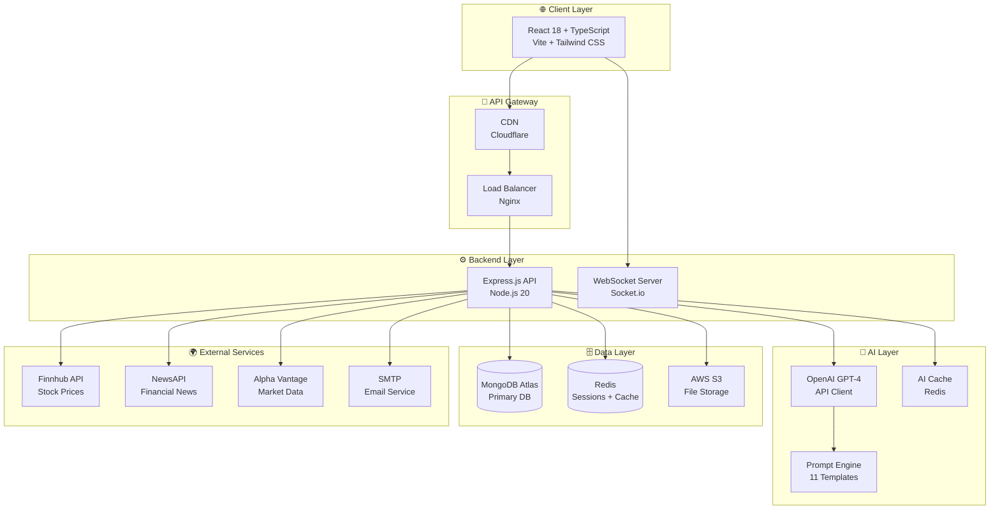
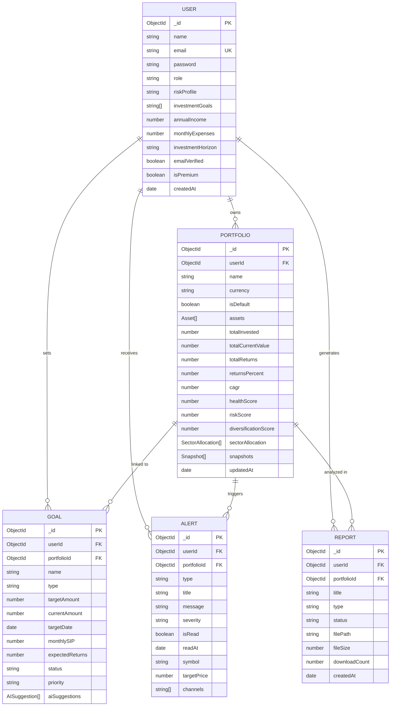
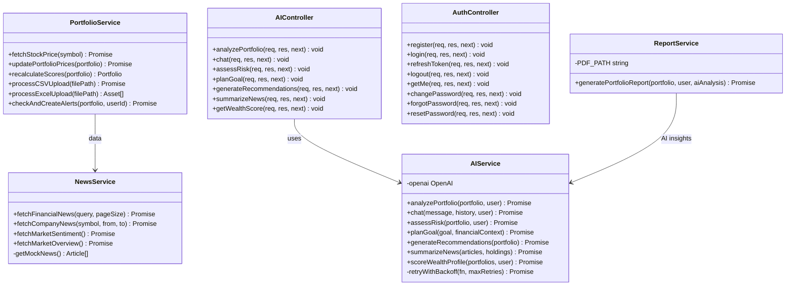
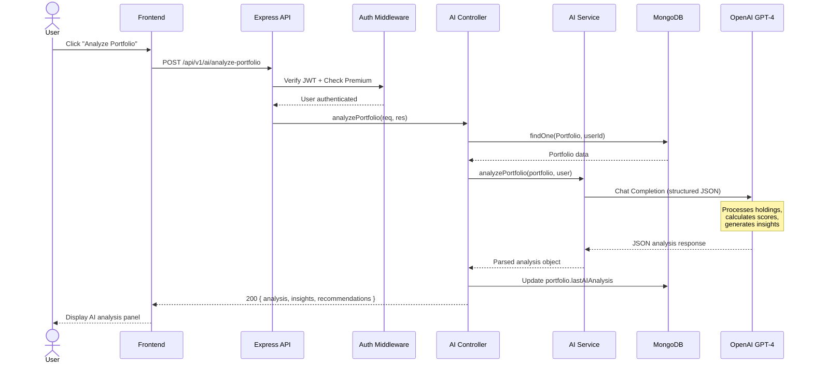
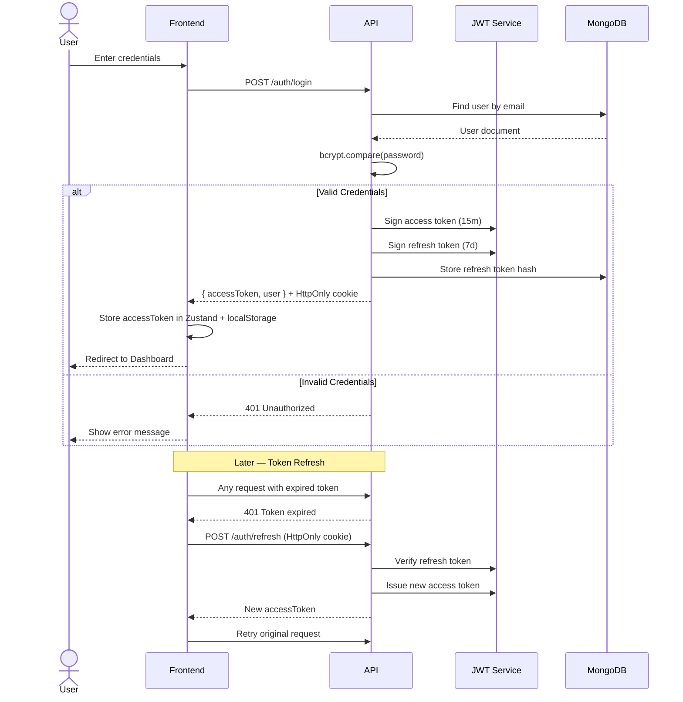
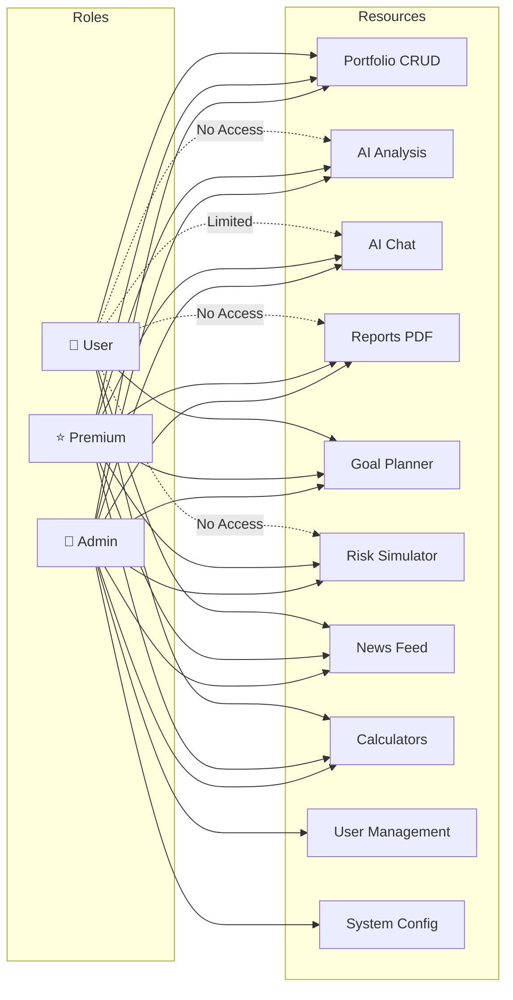
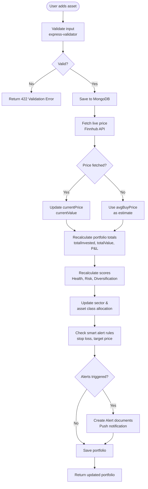
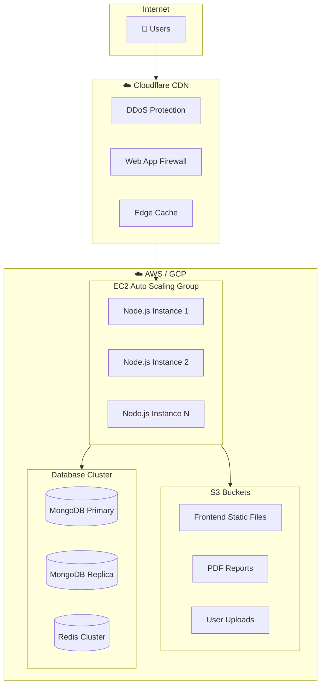
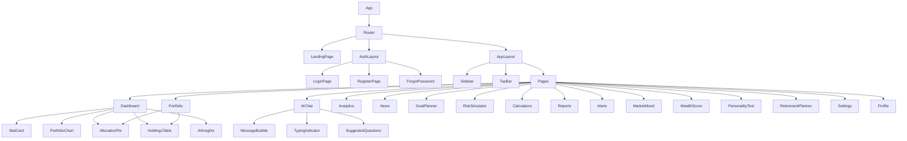
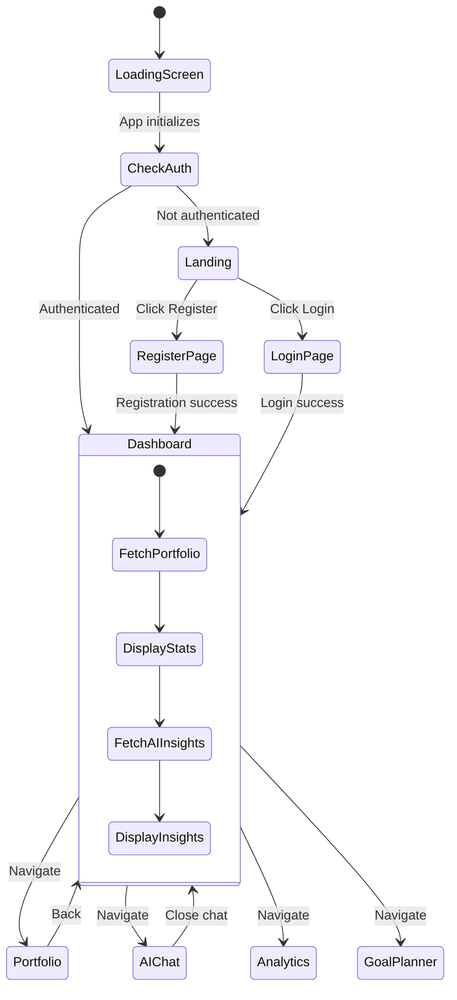

# UML & Architecture Diagrams

> All diagrams are written in **Mermaid** and render natively on GitHub.

---

## 1. System Architecture Diagram

---

## 2. Entity Relationship (ER) Diagram

---

## 3. Class Diagram — Backend Services

---

## 4. Sequence Diagram — AI Portfolio Analysis

---

## 5. Authentication Flow Diagram

---

## 6. RBAC Security Model

---

## 7. Data Flow Diagram — Portfolio Update

---

## 8. Deployment Architecture

---

## 9. Component Hierarchy — Frontend

---

## 10. State Management Flow

