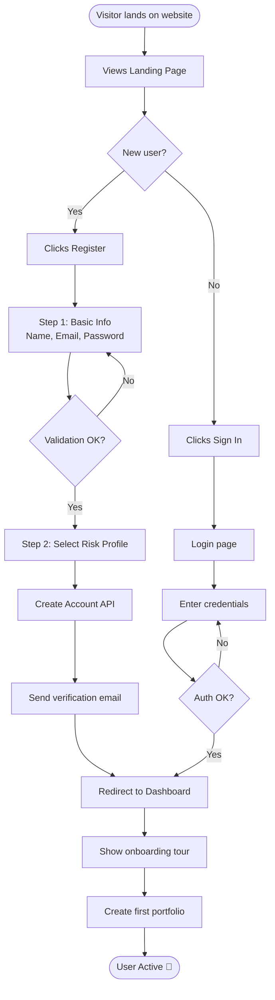
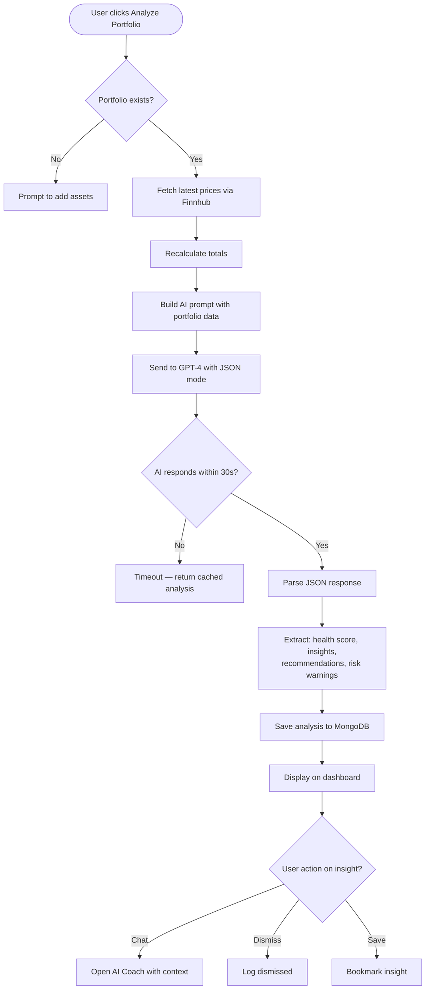
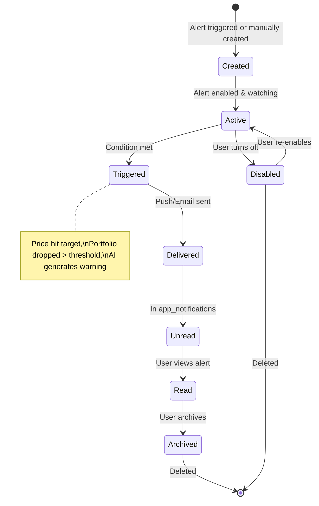
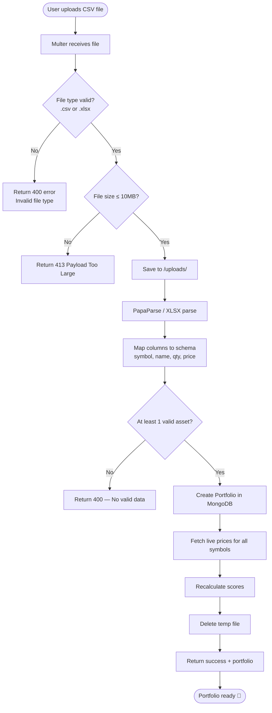
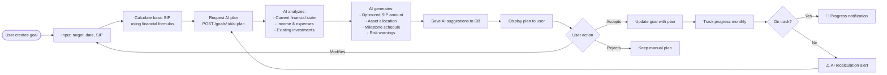
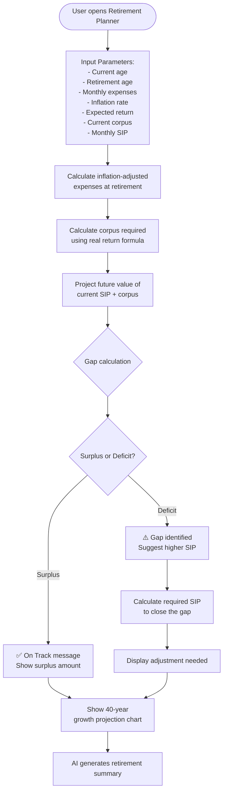
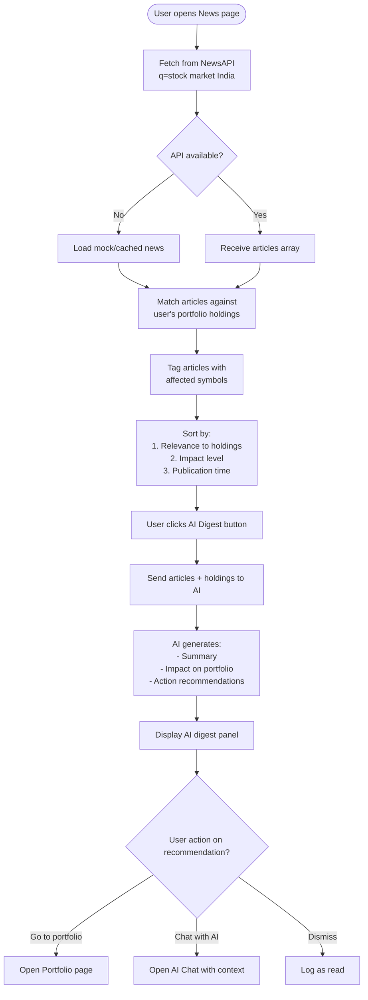
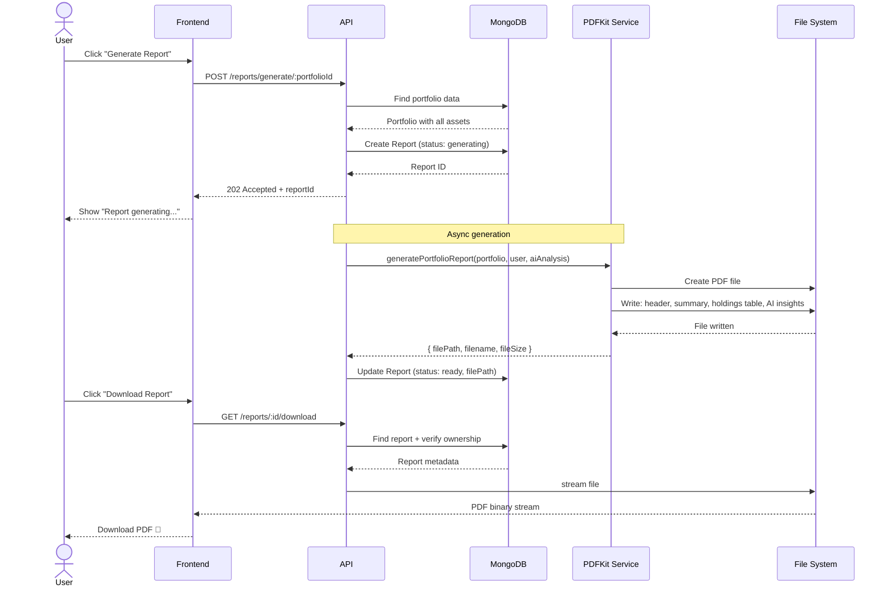
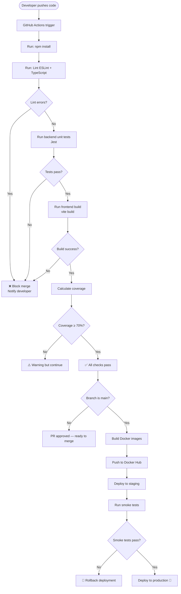
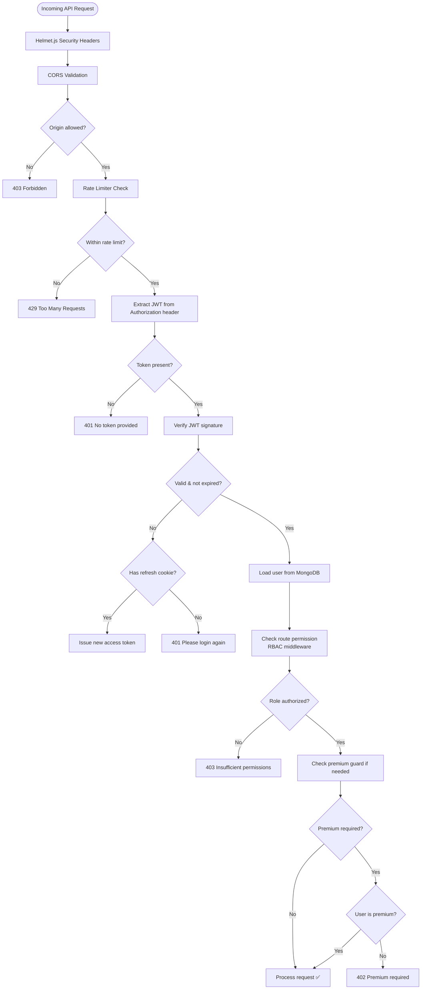

# Workflow Diagrams

> All diagrams are in **Mermaid** format and render natively on GitHub.

---

## 1. User Registration & Onboarding Workflow

---

## 2. AI Portfolio Analysis Workflow

---

## 3. Smart Alert Lifecycle

---

## 4. CSV Portfolio Import Workflow

---

## 5. Goal Planning AI Workflow

---

## 6. Retirement Planning Workflow

---

## 7. News Intelligence Pipeline

---

## 8. Report Generation Workflow

---

## 9. CI/CD Pipeline Workflow

---

## 10. Security & Access Control Workflow

